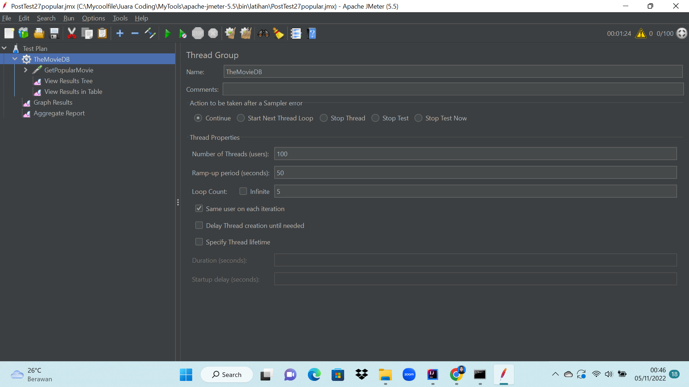
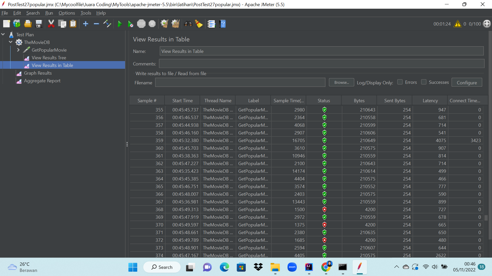

## JuaraCoding JMeter
### performance testing API themovieDB 

##  Get Popular Movie
### -Thread Group

### -Http Request

### -Response Assertion

### -View Results Tree

## -View Results Table

### -Graph Results

### -Aggregate Report

## Get Now Playing Movie
### -Thread Group

### -Http Request

### -Response Assertion

### -View Results Tree

### -View Results Table

### -Graph Results

### -Aggregate Report 

